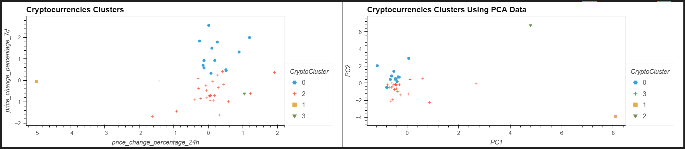

# CryptoClustering
# Module 19: Unsupervised Machine Learning

### Overview

For this assignment, I was asked to predict if cryptocurrencies are affected by 24-hour or 7-day price changes using the original and optimized datasets.

### Repo Contents

1. Images folder - contains images of the elbow curves and clusters
2. Resources folder - contains the crypto market data CSV file to be analyzed (crypto_market_data.csv)
3. Crypto_Clustering.ipynb - jupyter notebook containing code for below processing steps

### Processing Steps

1. Normalize the data using StandardScaler
2. Find the best value for k using the scaled dataframe
3. Cluster crypto currencies with K-means using the scaled dataframe
4. Optimize clusters with Principal Component Analysis
5. Find the best value for k using the PCA dataframe
6. Cluster crypto currencies with K-means using the PCA dataframe

### Analysis

By optimizing the dataset using Principal Component Analysis we were able to isolate the same number of data clusters using fewer features (see below visualizations).

